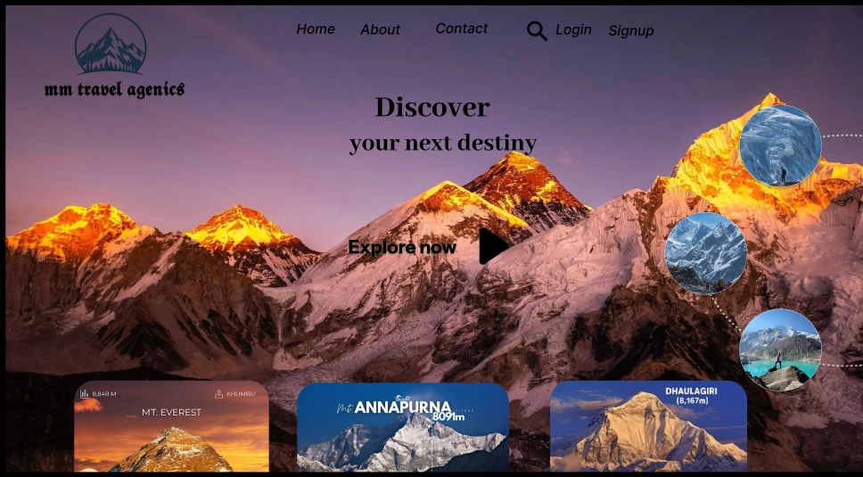

# 🏔️ Travel Agency Website UI/UX

> A modern and immersive travel agency website design focused on destination discovery, visual storytelling, and a memorable user experience.

## 📌 Project Overview

This project is a travel agency website UI/UX concept designed to inspire users to explore mountain destinations and discover their next travel experience.

The design combines large scenic imagery, destination cards, simple navigation, and clear call-to-action elements to create an engaging landing page.

## 🎯 Design Goals

- Create an immersive travel experience
- Make destinations visually attractive
- Keep navigation simple and intuitive
- Highlight popular mountain destinations
- Create a strong visual hierarchy
- Encourage users to explore destinations

## ✨ Key Features

- 🏔️ Mountain-focused hero section
- 🧭 Destination discovery
- 🖼️ Large visual imagery
- 📍 Destination cards
- 🔎 Simple navigation
- 🚀 Clear "Explore Now" call-to-action
- 📱 Responsive design concept

## 🎨 UI/UX Design

### Homepage Preview

## 🧠 UX Focus

The interface was designed around:

- **Visual hierarchy** — making the destination imagery the primary focus
- **Easy navigation** — keeping the main navigation simple and accessible
- **Destination discovery** — presenting multiple destinations visually
- **Clear CTA** — encouraging users to explore destinations
- **Engaging visuals** — using scenic photography to create an emotional connection

## 🛠️ Tools & Skills

- Figma
- UI/UX Design
- Wireframing
- Visual Design
- Prototyping
- Responsive Web Design

## 📂 Project Type

**UI/UX Design • Web Design • Travel Website**

## 👨‍💻 Designer

**Amaze Sphere**

UI/UX Designer & Web Developer

---

⭐ If you like this design, feel free to explore my other projects.
